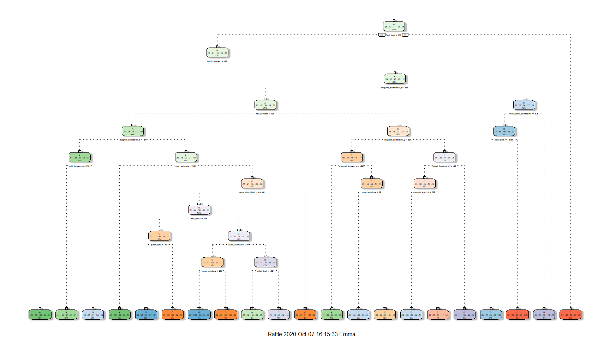

## Background

Using devices such as Jawbone Up, Nike FuelBand, and Fitbit it is now possible to collect a large amount of data about personal activity relatively inexpensively. These type of devices are part of the quantified self movement – a group of enthusiasts who take measurements about themselves regularly to improve their health, to find patterns in their behavior, or because they are tech geeks. One thing that people regularly do is quantify how much of a particular activity they do, but they rarely quantify how well they do it. In this project, the goal will be to use data from accelerometers on the belt, forearm, arm, and dumbell of 6 participants. They were asked to perform barbell lifts correctly and incorrectly in 5 different ways.

## Load all required libraries


```r
library(caret)
```

```
## Loading required package: lattice
```

```
## Loading required package: ggplot2
```

```r
library(rpart)
library(rpart.plot)
library(RColorBrewer)
library(rattle)
```

```
## Loading required package: tibble
```

```
## Loading required package: bitops
```

```
## Rattle: A free graphical interface for data science with R.
## Version 5.4.0 Copyright (c) 2006-2020 Togaware Pty Ltd.
## Type 'rattle()' to shake, rattle, and roll your data.
```


## Data collection and splitting

First, we load the dataset from online sources and split them into 75% training and 25% testing sets


```r
train_url <- "http://d396qusza40orc.cloudfront.net/predmachlearn/pml-training.csv"

test_url <- "http://d396qusza40orc.cloudfront.net/predmachlearn/pml-testing.csv"


train <- read.csv(url(train_url))
test <- read.csv(url(test_url))


inTrain <- createDataPartition(train$classe, p = 0.75, list=F)
training <- train[inTrain, ]
testing <- train[-inTrain, ]
```

## Data Cleaning


```r
# Looking at the structure of the training and testing datasets. 
# str(training)
# str(testing)
```

Now we remove zero variance variables and other irrelevant variables from the data. In addition, we drop variables that contain NA values


```r
NZV <- nearZeroVar(training)
training <- training[,-NZV]
testing <- testing[, -NZV]

NAvar <- apply(training, 2, function(x) mean(is.na(x))) < 0.60

training <- training[,NAvar]
testing <- testing[,NAvar]

# remove first 5 irrelevant variables
training <- training[,-c(1:5)]
testing <- testing[,-c(1:5)]

# convert the 'classe' column to factor
training$classe <- as.factor(training$classe)
testing$classe <- as.factor(testing$classe)
```

## Predictive modelling

Here, we will train 3 machine learning modelling algroithms and select the best among these having the best prediction accuracy on the testing set. The algorithms used are Decision Tree, Random Forest and Generalized Boosted Model. 

## 1. Decision Tree 


```r
set.seed(1234)
modelfitDT <- rpart(classe ~ .,data=training, method = "class")
```

## Dendrogram

<!-- -->

## Prediction and confusion matrix

```r
predictDT <- predict(modelfitDT, testing, type = "class")
confuMatDT <- confusionMatrix(predictDT, testing$classe)
confuMatDT
```

```
## Confusion Matrix and Statistics
## 
##           Reference
## Prediction    A    B    C    D    E
##          A 1234  154   32   42   46
##          B   52  582   58   70   95
##          C   16   47  696  122   68
##          D   74  132   39  535  105
##          E   19   34   30   35  587
## 
## Overall Statistics
##                                           
##                Accuracy : 0.741           
##                  95% CI : (0.7285, 0.7532)
##     No Information Rate : 0.2845          
##     P-Value [Acc > NIR] : < 2.2e-16       
##                                           
##                   Kappa : 0.6718          
##                                           
##  Mcnemar's Test P-Value : < 2.2e-16       
## 
## Statistics by Class:
## 
##                      Class: A Class: B Class: C Class: D Class: E
## Sensitivity            0.8846   0.6133   0.8140   0.6654   0.6515
## Specificity            0.9219   0.9305   0.9375   0.9146   0.9705
## Pos Pred Value         0.8183   0.6791   0.7334   0.6045   0.8326
## Neg Pred Value         0.9526   0.9093   0.9598   0.9331   0.9252
## Prevalence             0.2845   0.1935   0.1743   0.1639   0.1837
## Detection Rate         0.2516   0.1187   0.1419   0.1091   0.1197
## Detection Prevalence   0.3075   0.1748   0.1935   0.1805   0.1438
## Balanced Accuracy      0.9033   0.7719   0.8758   0.7900   0.8110
```

## 2. Random Forest


```r
set.seed(1234)
modelfitRF <- train(classe~., data=training, method="rf", trControl=trainControl(method = "cv", number = 5, verboseIter = F))

predictRF <- predict(modelfitRF, testing)
confuMatRF <- confusionMatrix(predictRF, testing$classe)
confuMatRF
```

```
## Confusion Matrix and Statistics
## 
##           Reference
## Prediction    A    B    C    D    E
##          A 1394    2    0    0    0
##          B    1  945    3    0    0
##          C    0    2  852    1    0
##          D    0    0    0  803    0
##          E    0    0    0    0  901
## 
## Overall Statistics
##                                           
##                Accuracy : 0.9982          
##                  95% CI : (0.9965, 0.9992)
##     No Information Rate : 0.2845          
##     P-Value [Acc > NIR] : < 2.2e-16       
##                                           
##                   Kappa : 0.9977          
##                                           
##  Mcnemar's Test P-Value : NA              
## 
## Statistics by Class:
## 
##                      Class: A Class: B Class: C Class: D Class: E
## Sensitivity            0.9993   0.9958   0.9965   0.9988   1.0000
## Specificity            0.9994   0.9990   0.9993   1.0000   1.0000
## Pos Pred Value         0.9986   0.9958   0.9965   1.0000   1.0000
## Neg Pred Value         0.9997   0.9990   0.9993   0.9998   1.0000
## Prevalence             0.2845   0.1935   0.1743   0.1639   0.1837
## Detection Rate         0.2843   0.1927   0.1737   0.1637   0.1837
## Detection Prevalence   0.2847   0.1935   0.1743   0.1637   0.1837
## Balanced Accuracy      0.9994   0.9974   0.9979   0.9994   1.0000
```

## Generalized Boosted Model


```r
set.seed(1234)
trControl <- trainControl(method = "repeatedcv", number = 5, repeats = 1, verboseIter = F)
modelfitGBM <- train(classe~., data=training, trControl=trControl, method="gbm", verbose=F)

predictGBM <- predict(modelfitGBM, testing)
confuMatGBM <- confusionMatrix(predictGBM, testing$classe)
confuMatGBM
```

```
## Confusion Matrix and Statistics
## 
##           Reference
## Prediction    A    B    C    D    E
##          A 1390    7    0    0    0
##          B    5  933   11    1    2
##          C    0    8  844    3    1
##          D    0    1    0  800    4
##          E    0    0    0    0  894
## 
## Overall Statistics
##                                           
##                Accuracy : 0.9912          
##                  95% CI : (0.9882, 0.9936)
##     No Information Rate : 0.2845          
##     P-Value [Acc > NIR] : < 2.2e-16       
##                                           
##                   Kappa : 0.9889          
##                                           
##  Mcnemar's Test P-Value : NA              
## 
## Statistics by Class:
## 
##                      Class: A Class: B Class: C Class: D Class: E
## Sensitivity            0.9964   0.9831   0.9871   0.9950   0.9922
## Specificity            0.9980   0.9952   0.9970   0.9988   1.0000
## Pos Pred Value         0.9950   0.9800   0.9860   0.9938   1.0000
## Neg Pred Value         0.9986   0.9960   0.9973   0.9990   0.9983
## Prevalence             0.2845   0.1935   0.1743   0.1639   0.1837
## Detection Rate         0.2834   0.1903   0.1721   0.1631   0.1823
## Detection Prevalence   0.2849   0.1941   0.1746   0.1642   0.1823
## Balanced Accuracy      0.9972   0.9892   0.9921   0.9969   0.9961
```

## Results 

We choose the Random Forest model because it has the highest accuracy 0.99 on the testing set. We therefore use the RF model for out of sample prediction on the new testing dataset. 


```r
prediction <- predict(modelfitRF, test)
prediction
```

```
##  [1] B A B A A E D B A A B C B A E E A B B B
## Levels: A B C D E
```

